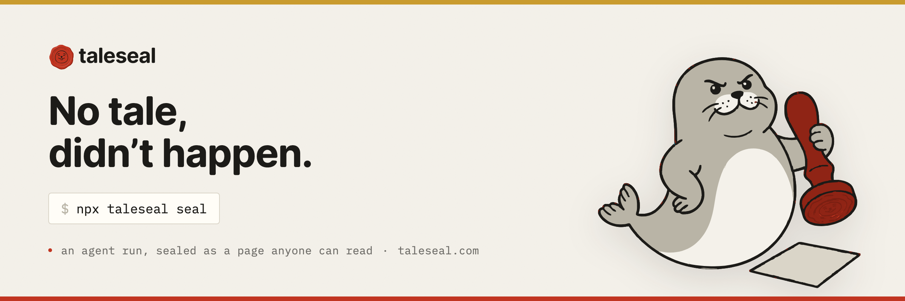

<p align="center">
  <a href="https://taleseal.com"></a>
</p>

<p align="center">
  <a href="https://www.npmjs.com/package/taleseal"></a>
  <a href="https://www.npmjs.com/package/@taleseal/sdk"></a>
  <a href="./LICENSE"></a>
</p>

<p align="center">
  <a href="https://taleseal.com/t/example">example tale</a> ·
  <a href="https://taleseal.com/start">get started</a> ·
  <a href="https://taleseal.com/integrate">integrate</a> ·
  <a href="https://taleseal.com/pricing">pricing (free)</a> ·
  <a href="https://taleseal.com/security">security &amp; trust</a>
</p>

# taleseal

Seal an agent run as a shareable **tale** — the narrative of what the agent did (trigger →
data consumed → decisions taken and set aside → outcome), published to one short, unguessable
URL. Plain English on top, the commands, diffs and test output underneath. Anyone with the
link can read how the agent got there; nobody needs an account to view.

```sh
npx taleseal seal      # reads the newest session locally, shows a preview, waits for your yes
```

This repository holds the official plugin marketplaces for [taleseal.com](https://taleseal.com).
All capture, redaction and publishing logic lives in the
[`taleseal` npm CLI](https://www.npmjs.com/package/taleseal); the plugins here are thin
wrappers that always show you a preview — redaction report included — before anything leaves
your machine.

## Install

### Claude Code

Inside Claude Code:

```
/plugin marketplace add Taleseal/taleseal
/plugin install taleseal@taleseal
```

Or from a shell:

```sh
claude plugin marketplace add Taleseal/taleseal && claude plugin install taleseal@taleseal
```

Then `/taleseal:seal` previews and publishes the current session, or just say
"seal this session".

### Codex

```sh
codex plugin marketplace add Taleseal/taleseal
codex plugin add taleseal@taleseal
```

Then ask Codex to "seal this session".

### Cursor

Coming — see [`plugins/cursor/`](./plugins/cursor).

## First run

Previews need no account. Publishing needs an API key: `npx -y taleseal login` opens the
browser, signs you up on the way if needed, and stores the key on your machine. On CI, mint
a key in the [dashboard](https://taleseal.com/dashboard) and set `TALESEAL_API_KEY`.

## Distributing to a team (Claude Code)

Add this to `.claude/settings.json` in your project and members are prompted to install on
first trust of the repository:

```json
{
  "extraKnownMarketplaces": {
    "taleseal": {
      "source": {
        "source": "github",
        "repo": "Taleseal/taleseal"
      }
    }
  },
  "enabledPlugins": {
    "taleseal@taleseal": true
  }
}
```

## Repository layout

`plugins/` holds one directory per surface (claude-code, codex, cursor), referenced by the
marketplace manifests at `.claude-plugin/marketplace.json` (Claude Code) and
`.agents/plugins/marketplace.json` (Codex). `packages/` and `docs/spec/` are reserved for
future additions — the open-sourced client packages and the published tale format
specification — so today's install paths never move.

## Security

See [SECURITY.md](./SECURITY.md). The plugins track `taleseal@latest` deliberately — the
API refuses outdated clients, so a pinned plugin would seal nothing — and nothing is
published without a human confirming the preview.

## Licence

[MIT](./LICENSE) © 2026 Nikic Company UK Ltd
